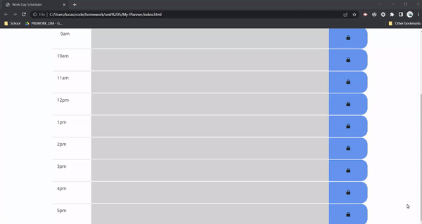

# My-Planner 

This project does a few things. It functions as a daily work planner. Dynamically updating the current date so that it is accurate. 
Each timeblock is also color coded based on time. If a task is in the past it is grey, if a task is due curretnly it is red, if a task in the future it is green! 

I learned how implement bootstrap styling and the use of jqeury selectors and functionality. I learned how to implement 3rd party API's such as moment to allow me to work with time. 

## Usage 

Simple Work Day Planner with color coded time frames 

## Mock up 

